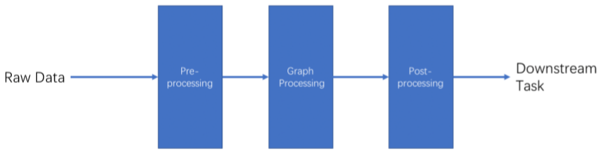

# Spark-graph-processing

In this project, have been implemented three parts of the typical pipeline of graph processing in real world scenario: **preprocessin**, **processing**, and **postprocessing**.
<p align="center">
</a>
</p>

## Preprocessing
In real word scenario, the raw graph data usually contains some sensitive information (like username of accounts, url, etc). So before used in the next step, these data need to be pre-processed to convert the raw identifier of vertices to the integer ID which contains no sensitive information. In this project, the preprocessing phase consists of a mapping program: raw identifier → integer id (from 0 ~|N-1|, |N| is the number of vertices). 

## Graph processing
- Pagerank [[link]](https://en.wikipedia.org/wiki/PageRank)
- Trustrank [[link]](https://en.wikipedia.org/wiki/TrustRank)

## Post-processing
This phase consists of a 're-mapping' operation: converts node ID (after pre-processing) in the results to raw identifier. 

## Requirements
- numpy
- pyspark

## Input graph
The input raw graph data are edge lists of unweighted and directed graphs in text form. An undirected graph can be made directed simply by adding the option `undirected` in the preprocessing phase. Each line of the file represents an edge in the format:  <source_identifier destination_identifier> (separator is one space). An example of raw graph data graph data can be found in the directory `graphs`.

## Usage examples

**Preprocess** the graph `wiki-Vote.txt`.
```
python preprocess.py --input_file wiki-Vote.txt --input_folder graphs
```
Compute **Pagerank** for 20 iterations and retrieve the top 5 nodes.
```
python pagerank.py --input_file wiki-Vote_mapped.txt --num_iterations 20 --k_top 5 -d 0.8
```
**Postprocess** the ranking results.
```
python postprocess.py --input_file wiki-Vote_mapped_pagerank_top-5.txt --mapping_file wiki-Vote_map.txt
```
Compute **Trustrank** for 20 iterations and retrieve all nodes. The option `white_list.txt` specifies the number of trusted nodes which will be randomly selected while initializing the trustrank.
```
python trustrank.py --input_file wiki-Vote_mapped.txt --num_iterations 20 --white_list 100 -d 0.8
```
**Postprocess** the ranking results.
```
python postprocess.py --input_file wiki-Vote_mapped_trustrank_top-all.txt --mapping_file wiki-Vote_map.txt
```
**Postprocess** the whitelist (benign nodes).
```
python postprocess.py --input_file wiki-Vote_mapped_trustrank_white_list.txt --mapping_file wiki-Vote_map.txt
```
